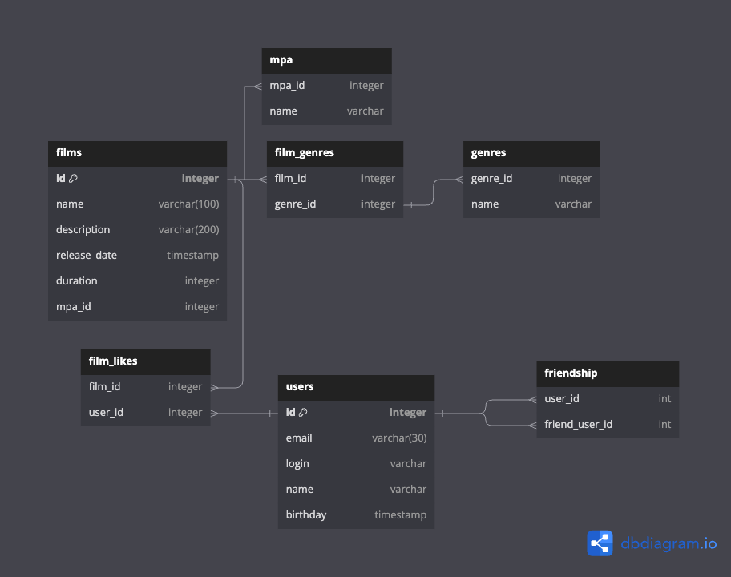

# java-filmorate

## CRUD-операции для базы данных такого типа
- Получить список всех пользователей
  `SELECT * FROM users`
- Получить список всех фильмов
  `SELECT * FROM films`
- Получить список всех жанров
  `SELECT * FROM genres`
- Получить список MPA
  `SELECT * FROM MPA`
